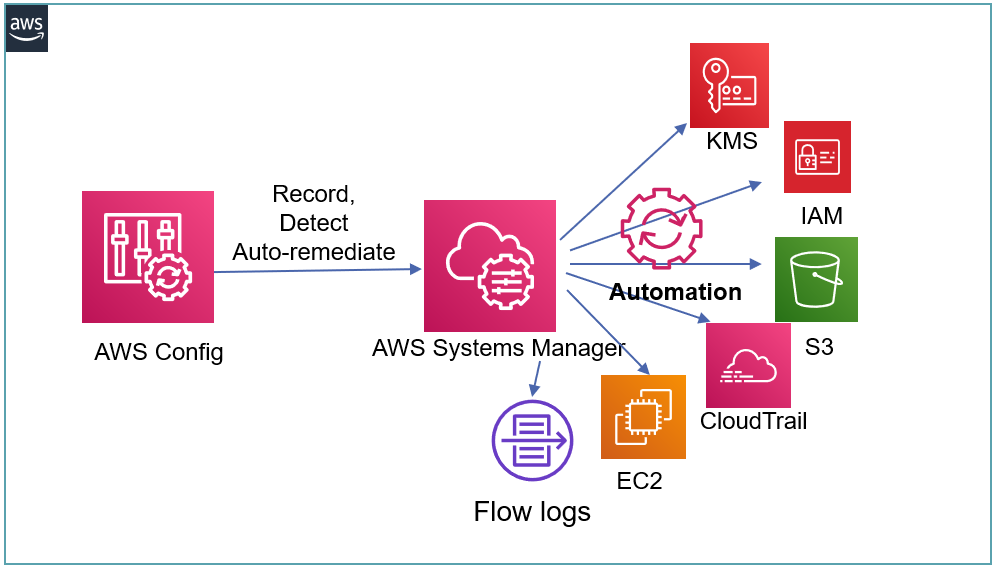

# Remediations for PCI Compliance using custom AWS Config Conformance Packs

Provides AWS Config Conformance Packs with Remediations for several PCI Compliance related violations  

Template 1 first provisions AWS Systems Manager Automation Documents as well as all the required pre-reqs. The Conformance Pack templates are deployed via the CLI and they leverages the SSM documents within AWS Config Remediation Rules in the format of Conformance Packs.

## How it Works

1. aws-pci-confpack-ssmautomation-v1.yml
- Provisions custom AWS Systems Manager automation documents for remediation. These documents are used to provide automated remediations within the provisioned AWS Config rule using the AWS:Config:RemediationConfiguration CloudFormation construct in the AWS Config Conformance Pack. 
- Provisions pre-requisites for the AWS Config Conformance Pack deployment such as the AWS Systems Manager automation role, S3 buckets for logging and replication for S3 related remediations and CloudWatch logs and CloudWatch role for AWS CloudTrail related remediations for PCI compliance
3. Custom AWS Config Conformance Packs
- aws-pci-conformancepack-v1-1.yml – Provisions a custom AWS Config Conformance Pack for the detection and remediation for Amazon EC2, AWS Auto Scaling and AWS Lambda based  PCI Compliance violations
- aws-pci-conformancepack-v1-2.yml - Provisions a custom AWS Config Conformance Pack for the detection and remediation for AWS CloudTrail, AWS KMS and AWS CodeBuild based CIS and PCI ompliance violations 
- aws-pci-conformancepack-v1-3.yml - Provisions a custom AWS Config Conformance Pack for the detection and remediation for Amazon Redshift, AWS RDS and AWS IAM based CIS anD PCI Compliance violations.

## Solution Design

## Prerequisites
1.	Custom AWS Config Conformance Packs - Set up prerequisites for deploying and building with both AWS Config Conformance Packs as well as custom AWS Config Conformance Packs with remediations. Refer to AWS documentation or this excellent blog for pre-reqs - https://aws.amazon.com/blogs/mt/introducing-aws-config-conformance-packs/

## How To Install

1. **Template 1 of 2:** aws-pci-confpack-ssmautomation-v1.yml
* Sets up AWS Systems Manager Automation Documents for several CIS and PCI related remediations and the required pre-requisites. No parameters needed. Installs in approx 2-3 mins.
 
2. **Template 2 of 2:** aws-pci-confpack-codepipeline.yml
* Create an S3 Bucket and upload the aws-pci-conformancepack-v1-[1,2,3].yml templates there. Use the aws-configservice put-conformance-pack CLI. For e.g. in the CLI below we have an S3 bucket (s3-pciautohealconfpack-<accountid>-<region>) that contains the aws-pci-conformancepack-v1-1.yml AWS Config Conformance Pack template. The delivery bucket is the S3 bucket associated with AWS Config that has the relevant bucket permissions as outlined in the pre-reqs.
		- aws configservice put-conformance-pack --conformance-pack-name="confpack-pci-1" --template-s3-uri="s3://s3-pciautohealconfpack-<ACCOUNT_ID>-<REGION>/aws-pci-conformancepack-v1-1.yml" --delivery-s3-bucket="config-bucket-
		<ACCOUNT_ID>
* Installs aws-pci-conformancepack-v1-[1,2,3].yml for custom AWS Config Conformance Packs with Remediation for PCI

## COVERAGE

The [Coverage Matrix](https://github.com/kmmahaj/config/blob/master/aws-conformancepack-pci/coverage/AWS%20SecurityHub%20Benchmarks-Coverage-v1.xlsx) provides the current coverage of this solution wrt the PCI Benchmarks

## @kmmahaj
